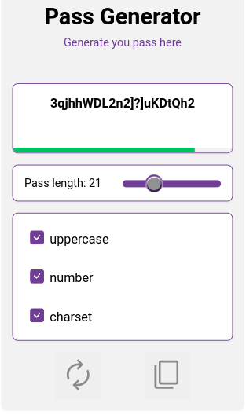

# password_generator

HTML, CSS, and JavaScript password generator project, providing a user-friendly interface and secure random password generation.

## preview

## features

- [x] Generate passwords ranging from 4 to 64 characters.
- [x] Options to include or exclude specific characters in the password.
- [x] Reset and copy buttons for easy management of the generated password.

## [>>  DEPLOY  <<](https://cesardmn.github.io/password_generator/)

 
 

## Developed by Cesar Dimi.

 
 
